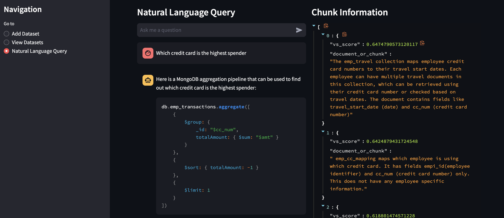

# MQL Bot
- This MQL Generator application converts end user query to MQL based on their own data catalog. 

- A data catalog here is a mongodb collection where each document contains description of a dataset in end user's datalake. Each document also has vector embedding of the description 

- We have used OpenAI - gpt-4o as our LLM and text-embedding-3-small as our embedding model

- We have used Langchain as AI Orchestration framework

- We have used streamlit library to build the UI for MQL Generator. The UI also displays the information chunks provided to LLM to generate the MQL query.

- We have added a few sample datasets and data catalog generated for these dataset in data directory.


# RAG Architecture Diagram


### Below is a screenshot of chatbot application's UI 



## AI Stack
- Langchain - AI Orchestration Framework
- Embedding Model - text-embedding-3-small
- LLM - gpt-4o
- Mongodb Atlas - vector store


## Pre-requisites
- Install necessary libraries using and setup conda and venv respectively
   - conda-spec-file.yml for conda users
   - requirements.txt for pythin virtual environment users
- Activate the conda or python venv
   - conda activate LnL
- You must have an OPEN AI API Key
- Mongodb Atlas Cluster - Free tier M0 will also work

## Steps

### Modify below files and add all variable values
- ./.env - this is Travelmate's data ingest configuration file

   ```
   OPENAI_API_KEY=ENTER YOUR OPENAI_API_KEY
   MONGODB_ATLAS_CLUSTER_URI = 'ENTER YOUR MONGODB ATLAS CONNECTION STRING'
   MDB_NAME = 'nql_db
   COLLECTION_NAME = 'datasets'
   ATLAS_VECTOR_SEARCH_INDEX_NAME='default' # This is the default index name for Atlas Search, you can change this but remember to update secrets.toml in .streamlit directory as well
   ```
- ./.streamlit/secrets.toml - this is Travelmate's streamlit UI configuration file

   ```
   OPENAI_API_KEY="ENTER YOUR OPENAI_API_KEY"
   MONGODB_URI = "ENTER YOUR MONGODB ATLAS CONNECTION STRING"
   DB_NAME = "nql_db"
   TRAVEL_COLLECTION_NAME = "datasets"
   ATLAS_VECTOR_SEARCH_INDEX_NAME = "default"
   ```

### Run below command for Data ingestion and Atlas Vector search index creation
   
   ```
   cd script
   python ingest_datasets.py
   ```

### Run below command to run the Streamlit UI and start chatting
```
streamlit run ./app.py
```


