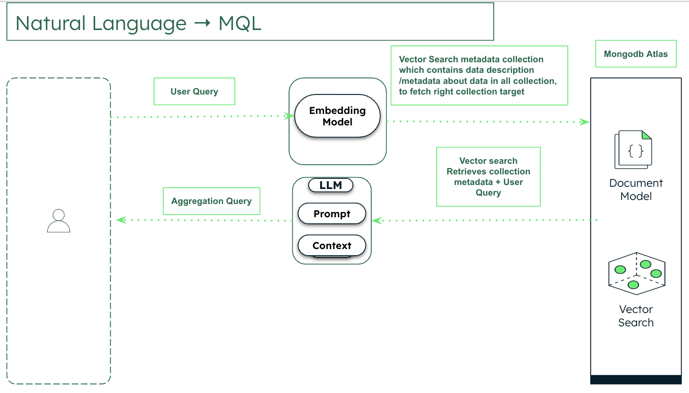

# Travelmate
- This RAG Chatbot application enables UI based chat experience with dataset [MongoDB/airbnb_embeddings](https://huggingface.co/datasets/MongoDB/airbnb_embeddings) where vector embedding are stored in text_embeddings field. 
- The dataaset contains information about airbnb accommodation listings and their description, text_embeddings is for description field
- This application leverages Atlas’s vector search index as vector store along with Open AI’s LLM capabilities and langchain framework for AI orchestration. 
- We have used streamlit library to build the UI for Travelmate. The UI also displays the information chunks provided to LLM to generate the recommendations.
- This [medium article](https://medium.com/p/8e7636207921)  gives an in-depth understanding of underlying tech leveraged for building this chatbot

RAG Architecture Diagram



Below is a screenshot of chatbot application's UI 


## AI Stack
- Langchain - AI Orchestration Framework
- Embedding Model - text-embedding-3-small
- LLM - GPT 3.5 Turbo
- Mongodb Atlas - vector store


## Pre-requisites
- Install necessary libraries using 
   - conda-spec-file.txt for conda users
   - requirements.txt for pythin virtual environment users
- You must have an OPEN AI API Key
- Mongodb Atlas Cluster - Free tier M0 will also work

## Steps

### Modify below files and add all variable values
- ./travelmate/prep_data/.env - this is Travelmate's data ingest configuration file

   ```
   OPENAI_API_KEY=ENTER YOUR OPENAI_API_KEY
   MONGODB_ATLAS_CLUSTER_URI = 'ENTER YOUR MONGODB ATLAS CONNECTION STRING'
   MDB_NAME = 'ENTER YOUR DATABASE NAME'
   COLLECTION_NAME = 'ENTER YOUR COLLECTION NAME'
   ATLAS_VECTOR_SEARCH_INDEX_NAME='default' # This is the default index name for Atlas Search, you can change this but remember to update secrets.toml in .streamlit directory as well
   ```
- ./.streamlit/secrets.toml - this is Travelmate's streamlit UI configuration file

   ```
   OPENAI_API_KEY="ENTER YOUR OPENAI_API_KEY"
   MONGODB_URI = "ENTER YOUR MONGODB ATLAS CONNECTION STRING"
   DB_NAME = "ENTER YOUR DATABASE"
   TRAVEL_COLLECTION_NAME = "ENTER YOUR COLLECTION"
   ATLAS_VECTOR_SEARCH_INDEX_NAME = "YOUR INDEX NAME as per .env in prep_data folder"
   ```

### Run below command for Data ingestion and Atlas Vector search index creation
   
   ```
   cd travelmate/prep_data
   python ingest_dataset.py
   ```

### Run below command to run the Streamlit UI and start chatting
```
cd ../../
streamlit run ./rag_travelmate.py
```


